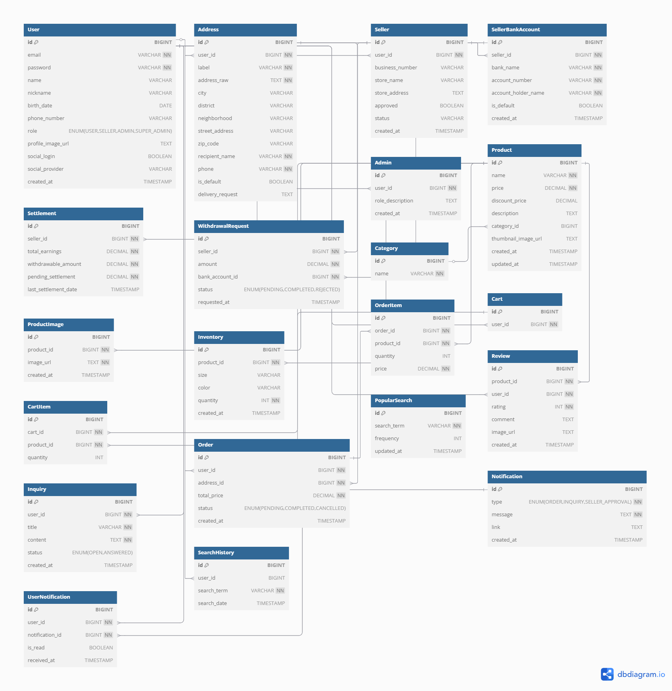
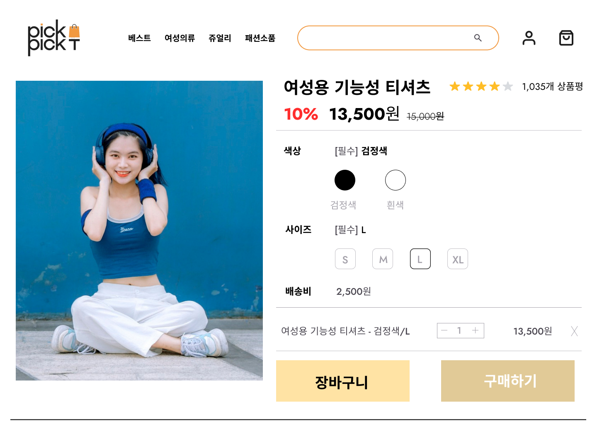
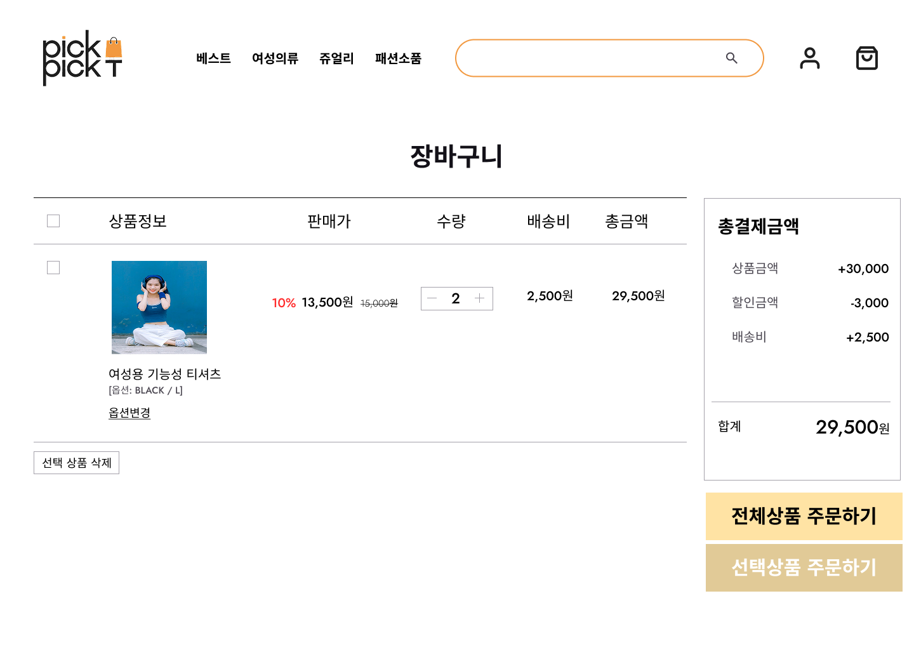
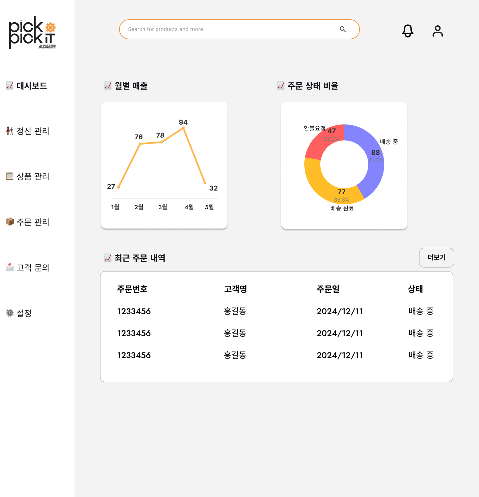
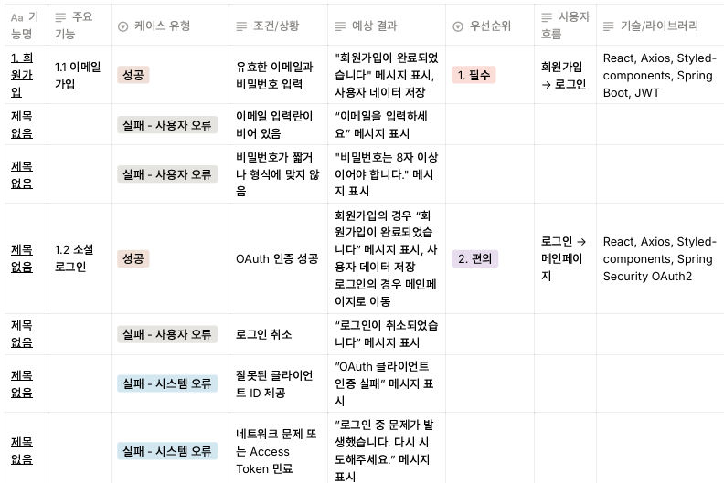
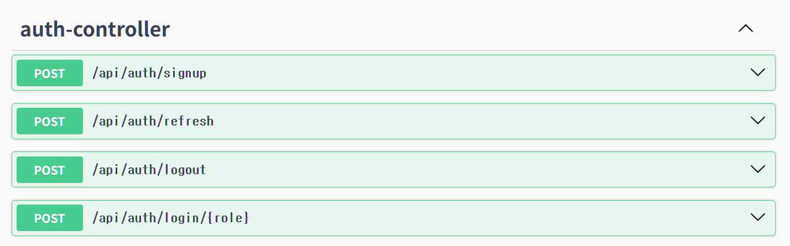
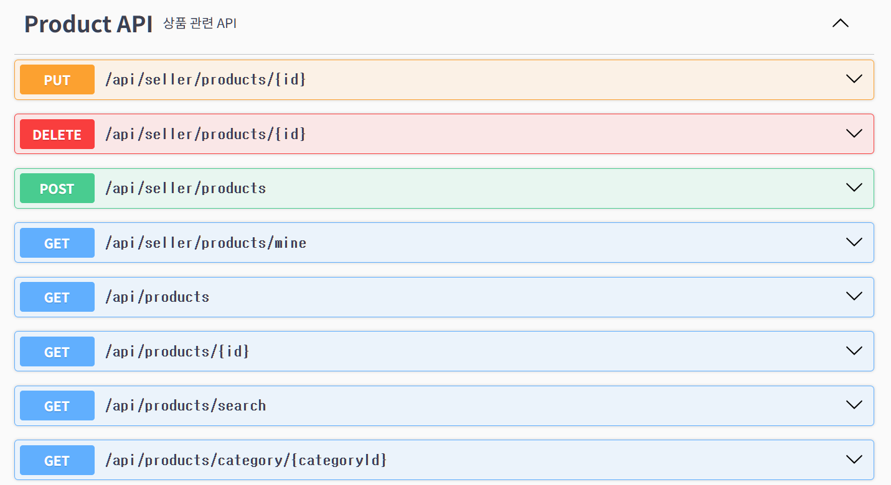

# 🛒 Pickit (개인 프로젝트, 진행 중)

## 🚀 프로젝트 개요

> Pickit은 **판매자와 사용자를 연결하는 쇼핑몰 서비스**로, Spring Boot와 React 기반으로 개발했습니다. JWT 인증, Redis 기반 이메일 인증, 상품 관리/조회 등 **실무 핵심 기능을 직접 구현**하며 학습과 포트폴리오를 겸하는 프로젝트입니다.

- 주요 목표: 인증/권한 관리, 이메일 인증, 판매자 상품 관리, 일반 사용자 상품 조회 구현, 판매자 대시보드/ 관리자 대시보드, 장바구니-주문-결제 로직

---

## 🛠 기술 스택

#### Backend

- Java 17, Spring Boot
- Spring Data JPA, MySQL
- Redis (이메일 인증/토큰 관리)
- JWT (인증/인가)
- Gradle

#### Frontend

- React
- Redux Toolkit 기반 전역 상태 관리 (인증 상태 등)
- Axios

#### Infra & Tools

- AWS EC2 (Spring Boot 백엔드 서버 배포)
- Ubuntu Linux
- Swagger (OpenAPI 기반 API 문서 자동화)
- GitHub, Postman

---

## 🔑 구현 기능

### ✅ 완료 (백엔드 기준)

- 회원가입 / 로그인 (JWT 인증)
- 이메일 인증 (Redis TTL 기반)
- 역할 기반 권한 분리 (일반 사용자 / 판매자)
- 판매자 상품 관리 API
- 일반 사용자 상품 조회 API

### 🔜 진행 중 / 예정

- 장바구니 / 주문 API
- 결제 API
- 관리자 기능

---

### 📌 기능 상세

#### 1. 회원가입 / 로그인

- JWT 인증 기반 로그인/로그아웃
- 이메일 인증 + Redis TTL 적용
- 역할 기반 권한(Role: 일반, 판매자) 분리

#### 2. 판매자 기능

- 판매자 회원가입
- 상품 등록/수정/삭제 API (이미지 업로드 포함)
- 재고 관리 로직

#### 3. 일반 사용자 기능

- 전체 상품 조회, 카테고리별 조회
- 검색 / 필터링 / 정렬
- 장바구니 / 주문 / 결제 (진행예정)

---

## 📑 ERD

---

## 🎨 와이어프레임

- Figma를 활용하여 사용자/판매자 중심의 주요 화면을 설계했습니다.

<table>
  <tr>
    <td></td>
    <td></td>
  </tr>
  <tr>
    <td></td>
    <td></td>
  </tr>
</table>

- 사용자와 판매자 중심의 UI/UX를 고려하여 화면을 설계했습니다.
- 로그인, 상품 상세, 장바구니, 판매자 대시보드 등 핵심 기능 흐름을 직관적으로 확인할 수 있습니다.

---

## 📑 기능 명세서

- Notion을 통해 서비스의 기능 요구사항을 정의하고 우선순위를 분류했습니다.

**주요 기능 요약**

- **회원가입/로그인**: 일반 사용자 / 판매자 구분
- **상품 관리**: 판매자 권한 기반 CRUD
- **주문 관리**: 장바구니, 결제, 주문 상태 조회
- **관리자 기능**: 판매자 승인 및 모니터링

---

## 📖 API 명세

- API 설계는 Notion에서 정리했고, Swagger를 활용해 자동 문서화를 진행했습니다.

**Swagger 문서 예시**

- 회원가입 / 로그인 API
  

  - 회원가입, 로그인, 로그아웃, 토큰 재발급

  - JWT + Redis를 활용한 이메일 인증 및 토큰 검증

  - 권한(Role) 분리: 사용자 / 판매자

- 상품 등록 / 조회 API
  

  - 판매자: 상품 등록/수정/삭제, 재고 관리

  - 사용자: 상품 조회/검색/필터링

  - 권한(Role) 기반 접근 제어 적용

  - 이미지 업로드 및 페이지네이션 지원

---

## 🌱 Git Workflow

- main: 배포 기준 브랜치
- develop: 기능 통합 브랜치
- feature/#이슈번호-\*: 기능 단위 개발 브랜치
- 이슈 단위로 feature 브랜치를 생성하고, PR을 통해 develop 브랜치에 병합합니다.

---

## 📎 참고 자료

- [🔗와이어프레임 (Figma)](https://www.figma.com/design/fdgL72jU3f2m6CLIqoYq1v/Pick-it?m=auto&t=f7avU7sGKWfkmELj-6)
- [🔗기능 명세서 (Notion)](https://yujin19.notion.site/bd24d87996a04b3c801517d976cc9e68?pvs=73)
- [🔗API 문서 (Notion)](https://yujin19.notion.site/API-151079bd63e78084ae77de3772a33f7c?pvs=73)

---

## 👤 개발자

- **이름**: 조유진
- **역할**: Fullstack Developer
- **GitHub**: [Pickit](https://github.com/YujinJo19/pickit)
